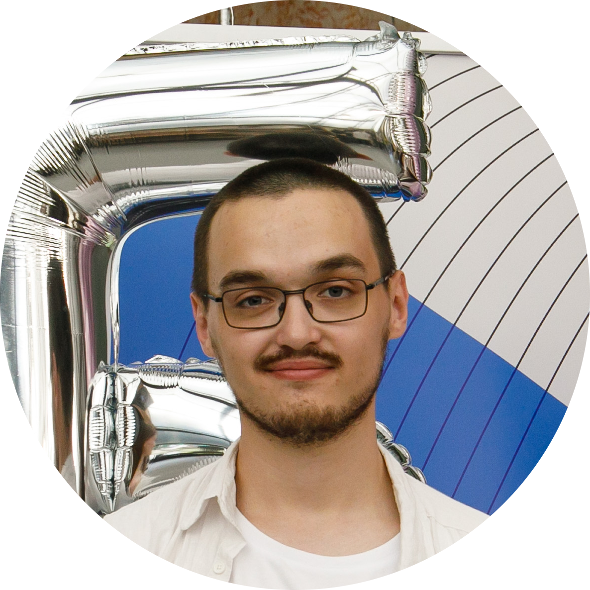

{width="350" style="display: block; margin: 0 auto"}

Меня зовут Рустам.

Увлекаюсь автоматизацией, аналитикой и программированием, а также смежными
направлениями.

Ввиду того, что я часто делаю "*Proof of Concept*" и "*Probe*" проекты, было
решено завести для этого блог. 

Здесь время от времени выкладываю заметки по различным темам, которые мне
показались интересными.

# Технологический стэк

- **Администрирование**: дистрибутивы Linux, права доступа, управление
  процессами, **nginx** (веб-сервер), сетевые протоколы, ведение документации
  (**mkdocs**);
- **DevOps**: основы **docker** и **ansible**, docker-compose (в т.ч.
  Portainer), **CI/CD** (GitHub Actions, GitLab CI);
- **Программирование**: **python** (в том числе: numpy, scipy, pandas,
  matplotlib), **bash** и zsh, **C/C++**;
- **Математика**: основы теории случайных процессов, машинное обучение,
  построение критериев для проверки **гипотез**, численные методы,
  моделирование (**метод отбора, MCMC, bootstrap**);
- **Вёрстка**: $\LaTeX$, Markdown, groff, HTML, CSS;
- **Общее**: чтение документации (на русском и английском), **git**,
  **терминал** (vim, tmux, различные утилиты командной строки);

# Обо мне
