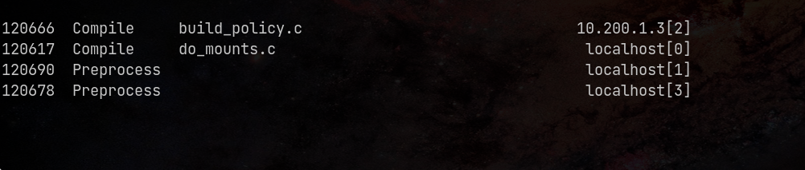

# Немного про распределенную компиляцию

## Мотивация / Введение

Про `gentoo` и распределенные системы.

Мне, как любителю Linux всегда было интересно изучить Gentoo 
Linux. На это есть множество причин, сейчас не о них. 
Суть в том, этап установки системы на виртуальную машину пройден и 
есть желание попробовать установить на второстепенный маломощный нетбук. 
Возникает проблема: Gentoo Linux -- это т.н. "source-based" дистрибутив, 
т.е. она распространяется в виде исходного кода. В свою очередь, компиляция
системы на нетбуке занимает чуть больше суток (возможно, это можно поправить
более тщательной конфигурацией перед сборкой, но, на мой взгляд, это 
слишком "хардкорный" путь для знакомства с системой). Конечно, компиляция 
ядра, строго говоря, необязательна, так как можно поставить предварительно 
скомпилированную версию. Но так неинтересно.

Таким образом, возникает вопрос -- можно ли ускорить компиляцию
на слабых ПК? Тут на помощь приходит `distcc`, 
своего рода фронтенд для компиляторов C/C++.

Сегодня мы хотим посмотреть на возможность компиляции ядра Linux (минимальной
конфигурации `tinyconfig`) на двух виртуальных машинах с разными 
характеристиками. Но для этого нужно рассказать про утилиту `vagrant`,
конфигуратор виртуальных машин.

## Vagrant

Vagrant[^1] (с англ. — «бродяга») — свободное и открытое программное
обеспечение для создания и конфигурирования виртуальной среды разработки.
Является обёрткой для программного обеспечения виртуализации, например
VirtualBox, и средств управления конфигурациями, таких как Chef, Salt и 
Puppet.

Данная утилита полезна тем, что позволяет, используя шаблоны виртуальных
машин, запускать их. Для описания стэка требуется один т.н. Vagrantfile. 
Она может работать совместно с qemu, VirtualBox, VMWare и пр. 

О vagrant стоит знать потому, что в какой момент, эксперементируя с 
виртуальными машинами, надоест каждый раз их устанавливать в условном VMWare.

## Distcc

distcc[^2] (от англ. distributed C/C++/ObjC compiler) — инструмент, 
позволяющий компилировать исходные коды при помощи 
компиляторов C/C++/ObjC на удалённых машинах, что ускоряет процесс компиляции.

Важно понимать, что это своего рода фронтенд для компиляторов, 
сам по себе он не компилирует код.

## Компиляция

### Демонстрация стенда

Для начала построчно рассмотрим Vagrantfile.
При его написании используется язык Ruby.

Описание "шаблона" для виртуальных машин. В данном случае это Debian 
12 Bookworm.

```ruby
# Default box
box_name = "debian.jessie64.libvirt.box"
```

Файл можно скачать с сайта HashiCorp. 

Описание виртуальной машины, на которой будет основная компиляция:

```
# Master
master_node = {
  :hostname => "master", :ip => "10.200.1.2", :memory => 1024, :cpu => 1
}
```

Характеристики:

- IP: 10.200.1.2,
- RAM: 1Gb,
- 1 поток.

Они похожи на характеристики моего нетбука, но занижены в целях демонстрации.

Описание второстепенной виртуальной машины:

```
# List of slaves
slaves = [
  { :memory => 4096,  :cpu => 4 },
]
```

Характеристики:

- RAM: 4Gb,
- 4 потока.

Скрипт для автоматической установки зависимостей:

```
$distcc_install = <<-SCRIPT
apt update
apt install -y make distcc gcc g++ tmux libz-dev git fakeroot build-essential ncurses-dev xz-utils libssl-dev bc flex libelf-dev bison time neofetch
SCRIPT
```

Старт конфигурации виртуальных машин:

```
Vagrant.configure("2") do |config|
```

Конфигурация основной машины:

```
  # Master node's config
  config.vm.box_check_update = false
  config.vm.define master_node[:hostname] do |nodeconfig|
    nodeconfig.vm.box = box_name
    nodeconfig.vm.hostname = master_node[:hostname]
    nodeconfig.vm.network(:private_network, ip: master_node[:ip])
    nodeconfig.vm.provision "shell", inline: $distcc_install
    nodeconfig.vm.provision "file", source: "./linux-6.13.tar.gz", destination: "~/linux-6.13.tar.gz"
    nodeconfig.vm.provider :libvirt do |vb|
      vb.memory = master_node[:memory]
      vb.cpus = master_node[:cpu]
    end
  end
```

В нем:

1. Отключаются обновления,
2. Задаются характеристики ВМ,
3. Запускается скрипт установки зависимостей,
4. Копируется 
   [архив](https://cdn.kernel.org/pub/linux/kernel/v6.x/linux-6.13.tar.gz)
   с исходным кодом ядра (должен лежать в директории с Vagrantfile).

Конфигурация второстепенных машин:

```
  # Slaves configs
  slaves.each_with_index do |slave, i|
    config.vm.box_check_update = false
    config.vm.define "slave-#{ i+1 }" do |nodeconfig|
      # Default box-name (cause I have only it)
      nodeconfig.vm.box = box_name
      
      # Hostname: slave-N
      nodeconfig.vm.hostname = "slave-#{ i+1 }"

      # IP-address: 10.200.1.{N+2}
      nodeconfig.vm.network :private_network, ip: "10.200.1.#{ i+3 }"
      nodeconfig.vm.provision "shell", inline: $distcc_install
      nodeconfig.vm.provider :libvirt do |vb|
        vb.memory = slave[:memory]
        vb.cpus = slave[:cpu]
      end
    end
  end
end
```

Стоит обратить внимание, что IP задается автоматически, начиная от 
`10.200.1.3` и далее. Сделано это на случай нескольких ВМ.

### Компиляция на одной машине (gcc)

Для начала запустим стенд командой `vagrant up`. На моем ноутбуке это занимает 
примерно 127 секунд.

Далее необходимо подключиться к главной машине и распаковать исходники ядра[^3]:

```
vagrant ssh master
tar xvf linux-6.13.tar.gz
cd linux-6.13
```

Создаем файл минимальной конфигурации 
(с остальными вариантам можно ознакомиться командой `make help | less`):

```
make tinyconfig
```

> **Важно**: для чистоты эксперимента все замеры делаются после команды `make 
    distclean` (см. `make help`).

Запускаем компиляцию с замером времени:

```
time -p make CC=gcc
```

### Компиляция на одной машине (distcc)

По смыслу, все тоже самое, только нужно указать distcc, на каких хостах 
можно компилировать:

```sh
export DISTCC_HOSTS="localhost"
```

Запускаем компиляцию с замером времени:

```
time -p make CC="distcc gcc"
```

### Компиляция на двух машинах (distcc)

Для запуска распределенной компиляции, нужно сначала запустить демон на
второй виртуальной машине. Для этого подключаемся к ней и запускаем его:

```
vagrant ssh slave-1
distccd --daemon --allow-private
```

Параметр `--allow-private` разрешает стучаться только с приватных сетей.

Для проверки можно:

1. На второй машине проверить открытые порты: `ss -ntlp | grep 3632`,
2. С основной машины постучаться в этот порт: `telnet 10.200.1.3 3632` 
   (выход на `C-] C-d`).

Теперь нужно добавить хост, чтобы на нем можно было удаленно компилировать. 
Для этого на основной машине:

```
export DISTCC_HOSTS="localhost 10.200.1.3"
```

Для проверки можно посмотреть список хостов для компиляции: `distcc --show-hosts`.

Запустим компиляцию на 5 потоках с замером времени:

```sh
time -p make -j5 CC="distcc gcc"
```

Мониторить компиляцию можно с помощью команды (на основной машине):

```
watch -n 1 distccmon-text
```



### Таблица сравнения

|Итерация|Одна машина (gcc), с|Одна машина (distcc), с|Две машины (distcc), с|
|:------:|:------------------:|:---------------------:|:--------------------:|
|   1    |        176         |           176         |          111         |
|   2    |        186         |           162         |          109         |
|   3    |        187         |           174         |          127         |
|Среднее |        183         |           170         |          115         |

## Итог

Можно увидеть, что такая параллелизация дает прирост 37%. 
Сложно сказать, можно ли разогнать сильнее, так как многое зависит от 
правил компиляции (например, их нельзя распараллелить больше чем на 5 потоков).

Очевидно, что распределенная компиляция при прочих равных будет проигрывать 
параллельной, так как общение между потоками по определению быстрее. 
Но для слабых машин это отлично подходит. К сожалению, у данного метода есть
существенные ограничения:

1. Версии gcc и distcc должны совпадать (хотя, пишут, что достаточно 
    совпадения только мажорных версий).
2. В некоторых случаях нет возможности общения по TCP и требуется подключение по 
    SSH. Например, когда есть ограничения безопасности или при сложной организации 
    сети. Определенно, такое подключение будет медленнее.

Все материалы стенда можно найти в 
[репозитории](https://github.com/rustbas/disgrant/) на Github.

[^1]: Википедия [Vagrant](https://ru.wikipedia.org/wiki/Vagrant).
[^2]: Википедия [distcc](https://ru.wikipedia.org/wiki/Distcc).
[^3]: Исходный код ядра можно найти [здесь](https://cdn.kernel.org/pub/linux/kernel/v6.x/linux-6.13.tar.gz).
