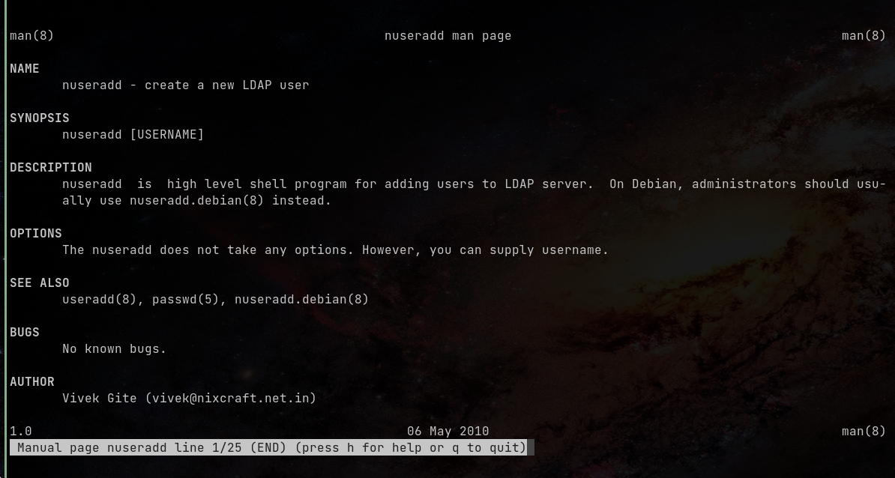
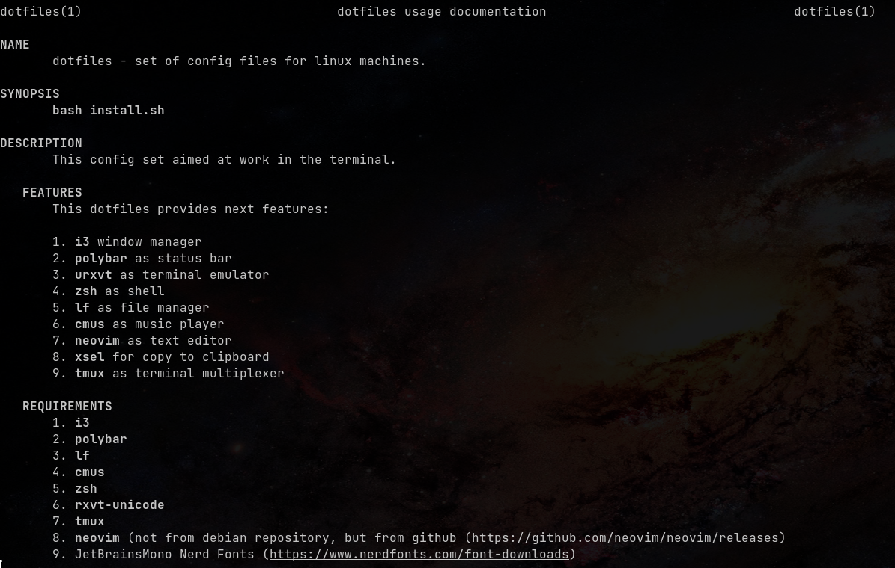

# Немного про мануалы

## Мотивация
 
Какое-то время назад возникла задача: 
написать мануал к репозиторию с дотфайлами.

Вообще, сложилось впечатление, что сейчас большая часть документации создается
либо автоматически, либо техническими писателями. Причем сама документация
лежит на каком-то сайте, например, **github.io** и нечасто можно получить 
к ней доступ офлайн. В таких случаях спасают `man`-ы.

## Способы

Вообще, сам мануал -- это документ для [препроцессора](https://en.wikipedia.org/wiki/Groff_(software)) `groff`, который 
умеет читать команда `man`, и который можно перевести в другие форматы, 
при желании.

[Пример](https://www.cyberciti.biz/faq/linux-unix-creating-a-manpage/) (`test.1`):

```groff
.\" Manpage for nuseradd.
.\" Contact vivek@nixcraft.net.in to correct errors or typos.
.TH man 8 "06 May 2010" "1.0" "nuseradd man page"
.SH NAME
nuseradd \- create a new LDAP user 
.SH SYNOPSIS
nuseradd [USERNAME]
.SH DESCRIPTION
nuseradd is high level shell program for adding users to LDAP server.  On Debian, administrators should usually use nuseradd.debian(8) instead.
.SH OPTIONS
The nuseradd does not take any options. However, you can supply username.
.SH SEE ALSO
useradd(8), passwd(5), nuseradd.debian(8) 
.SH BUGS
No known bugs.
.SH AUTHOR
Vivek Gite (vivek@nixcraft.net.in)
```

Если выполнить команду `man ./test.1`, то увидите следующее:


Красиво, но не слишком удобно для создания. Я использовал другой -- через
конвертацию `markdown`-файлов.

## Процесс

### `pandoc`

Для начала, нужна сама [программа](https://en.wikipedia.org/wiki/Pandoc) `pandoc`. Ставим:

```shell
sudo apt install pandoc
```

### Написание мануала

Само написание мануала, думаю, стоит опустить. Синтаксис `markdown`-а 
можно посмотреть на википедии. 

Есть только два нюанса при написании:

1. В начале нужно указать что-то вроде 
    `% dotfiles(1) | dotfiles usage documentation` 
2. По умолчанию, `pandoc` распознает каждую строку как отдельный 
    параграф. Из-за этого между строками в результате получается 
    разрыв. Чтобы избежать этого, нужно в конце строки добавлять `\`.
    
Сконвертировать файл можно командой:
```shell
pandoc --standalone --to man manpage.md  --output=dotfiles.1 
```
    
Также, стоит отметить принятое оглавление. Есть три обязательные секции:

- **NAME** - название
- **SYNOPSIS** - краткое описание (в одну строку) команды или примеры аргументов
    или ключей.
- **DESCRIPTION** - подробное описание команды
    
Также, можно указать:

- **OPTIONS** - описание опций/аргументов.
- **EXAMPLES** - примеры запуска.
- **FILES** - описание файлов, если есть файлы конфигурации.
- **ENVIRONMENT** - описание переменных окружения.
- **BUGS** - Известные баги/ошибки.
- **AUTHORS** - авторы.
- **SEE ALSO** - референсы к другим мануалам.
- **COPYRIGHT | LICENSE** - текст лицензии.

### Как пользоваться

Для того, чтобы можно было удобно пользоваться написанным мануалом, 
нужно:

1. Сжать его -- `gzip dotfiles.1`.
2. Поместить архив в любую папку, из которой читает `man` в директорию `man1`.

Для того, чтобы узнать директории, из которых читает `man`, 
можно выполнить команду `manpath`

В моем случае, я поместил все в директорию `$HOME/.local/share/man/man1`,
так как `$HOME/.local/share` это как раз `$XDG_DATA_HOME` 
(см. [спецификацию XDG](https://specifications.freedesktop.org/basedir-spec/latest/)).

Результат ([репозиторий](https://github.com/rustbas/dotfilesV2/tree/potatoless-pc)):


