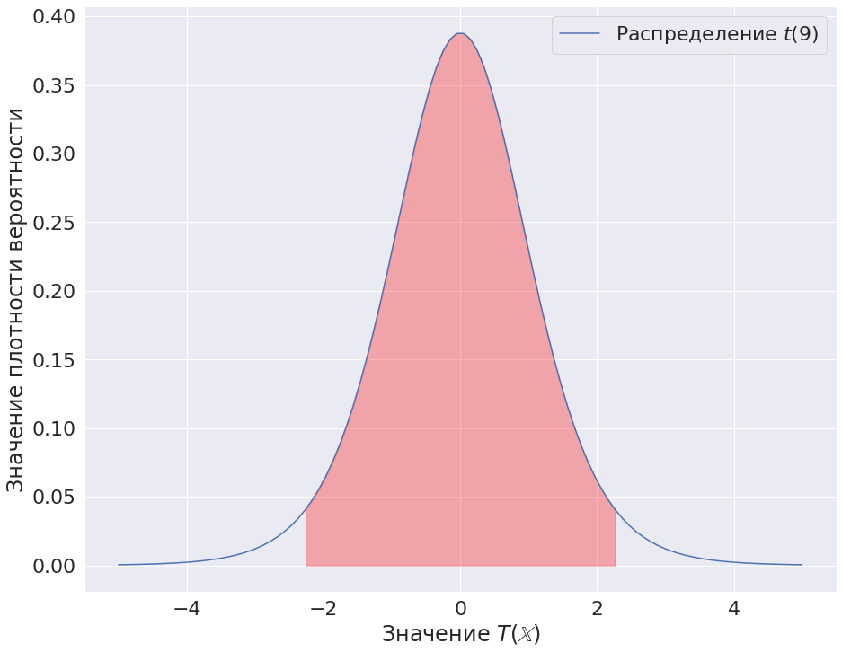
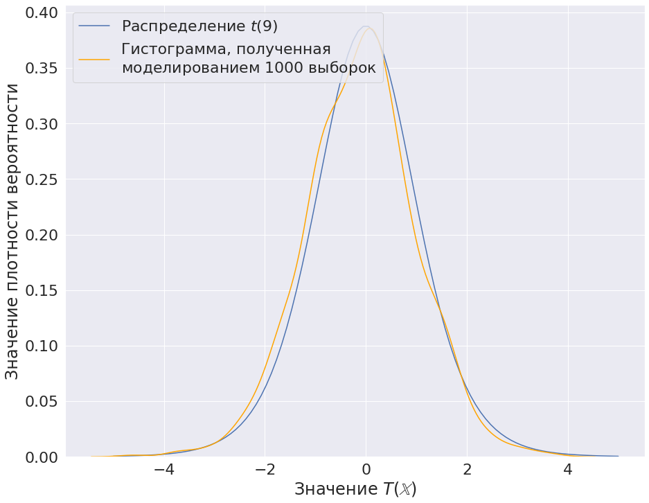
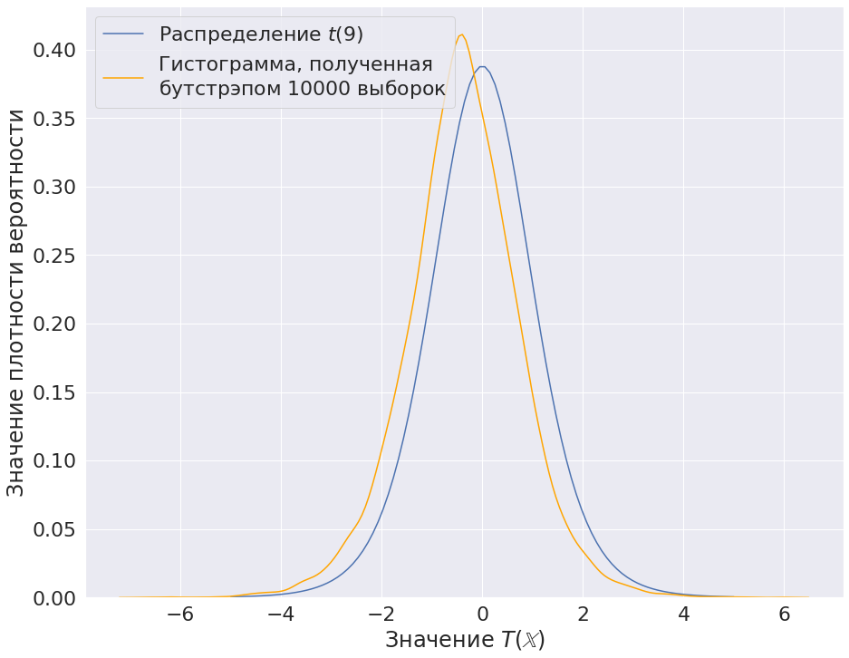

# Стадии развращения ученого-статистика

## Небольшой ликбез

В статистике, если упростить, проверку гипотезы можно описать так: 

1. По данной выборке считается статистика (т.е. функция от выборки).
2. Из распределения статистики находятся две области, где гипотеза отвергается и где нет. Исходя из этого, принимается решение.

**N.B.** Проверяется гипотеза, модель постулируется.

## Стадия 1. Строгие доказательства

На данной стадии ученый строго выводит распределения статистик, чтобы построить как можно более хорошие критерии. 

$$\Large
\sqrt{n}
\frac
{\overline{\mathbb{X}} - \mu}
{S} =
\sqrt{n}
\frac
{\overline{\mathbb{X}} - \mu}
{\sigma} \cdot
\frac{1}
{\frac{S}{\sigma}} =
$$

$$\Large
= \sqrt{n}
\frac
{\overline{\mathbb{X}} - \mu}
{\sigma} \cdot
\frac{1}
{\sqrt{\frac{(n-1)S^2}{\sigma^2}\cdot
\frac{1}{n-1}
}}
$$

Получим:

$$\Large
\begin{matrix}
&\sqrt{n}
\frac{\overline{\mathbb{X}} - \mu}
{\sigma} &\sim &N(0,1) \\
&\frac{(n-1)S^2}{\sigma^2} &\sim &\chi^2(n-1)
\end{matrix}
$$

Таким образом:

$$\Large
\sqrt{n}
\frac
{\overline{\mathbb{X}} - \mu}
{S} \sim T(n-1).
$$

Вывод распределения статистики для критерия Стьюдента

## Небольшой пример (критерий Стьюдента)

**Дано**: выборка Х объема 10

$$\Large
\mathbb{X} = \left( 
\begin{matrix}
3.175 \\
4.042 \\
2.127 \\
3.841 \\
1.699 \\
2.223 \\
3.211 \\
3.33  \\
2.447 \\
2.904 
\end{matrix}
\right)
$$

**Модель**: $N(\mu, \theta_2)$

**Нулевая гипотеза**: $\mu = 3$

**Решение**:

Статистика критерия:

$$\Large
T(\mathbb{X}) =
\sqrt{n}
\frac
{\overline{\mathbb{X}} - \mu}
{S} 
\sim
t(n-1)
$$

Статистика равна:

$$\Large
T(\mathbb{X}) = -1.9066
$$

Пусть уровень значимости $\alpha = 0.05$.

Область, где не отвергается нулевая гипотеза: $(g_1, g_2) = (-2.262, 2.262)$, т.е. это область, которую принимает значение статистики при условии верности нулевой гипотезы с вероятностью $1 - \alpha = 0.95$. $g_1$ в данном случае это $0.025$ - квантиль, а $g_2$ --- 0.975 - квантиль. 

Красным обозначен интервал $(g_1, g_2)$

Таким образом, нулевая гипотеза не отвергается, так как значение статистики лежит в данном интервале.

## Стадия 2. Открытие моделирования

Иногда (вернее даже как правило) распределение статистики вывести
невозможно. В таком случае пользуются моделированием. Идея в том, что
нам известно распределение выборки в случае нулевой гипотезы. Таким
образом, можно многократно генерировать выборки и считать статистику,
таким образом получив ее распределение.

Можно увидеть некоторое расхождение. В этом, кстати, заключается интересный момент. Часто критикуются исследования построенные на моделировании, так как есть ненулевая (хоть и очень маленькая) вероятность, что выборки сгенерировались так, что полученное распределение статистики не отражает реальность.

## Стадия 3. Бутстрэпное безумие

Бывают случаи, когда распределение выборки неизвестно совсем (или его нельзя в обычном смысле генерировать, [пример](https://stepik.org/lesson/40491/step/1?unit=24794)). В таком случае постулируют, что данная выборка хорошо отражает генеральную совокупность и в качестве функции распределения берут эмпирическую функцию распределения.

$$\Large
F_n(x) = \frac
{\sum_{i=1}^{n} \mathbb{1}(x)}
{n}
$$

где:

$$\Large
\mathbb{1}(x) =
\begin{cases}
1, x > X_i, \\
0, \text{ иначе.}
\end{cases}
$$

В итоге, получается, что для проверки гипотез не нужно ничего кроме выборки и выдуманной статистики (которая, вообще, может быть любой, от нее зависит только качество получаемого критерия).

Основная идея заключается в том, чтобы генерировать выборки объемом как и данная выборка из следующего распределения:

$$\Large
\mathcal{F} =
\begin{pmatrix}
X_1         &X_2         &\cdots &X_n \\
\frac{1}{n} &\frac{1}{n} &\cdots &\frac{1}{n} 
\end{pmatrix}.
$$

Таким образом, из расхождения графиков можно сделать следующие выводы:

- применение бутстрэпа требует большой объема первоначальной выборки,
- наблюдения в выборке должны быть независимыми.

Несмотря на это, он часто применяется невпопад, так как не требует особых затрат на реализацию.
