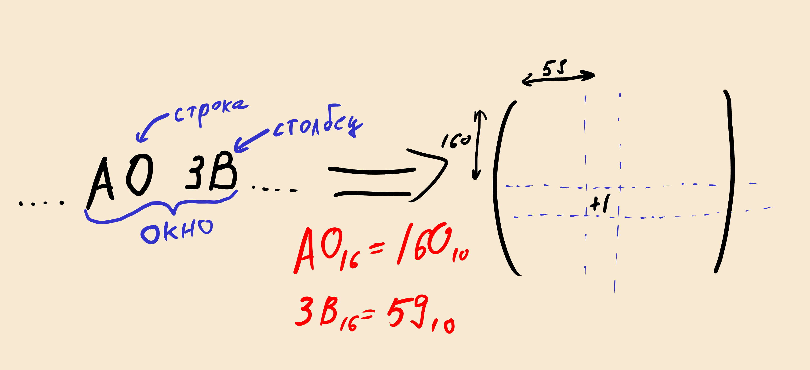
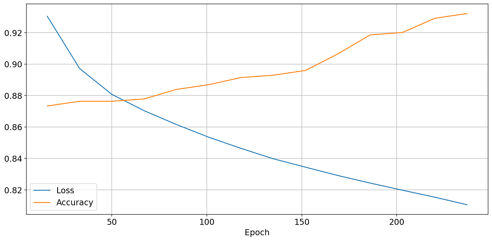

# Немного про работу с файлами, numpy и предсказаниях

## Введение / Мотивация

<!-- TODO: Попробовать нарисовать картинки? -->

Известно, что файлы в памяти представлены последовательностью байтов.
Структурно, эта последовательность может быть разной. Она может
содержать только ASCII-текст, текст с любой кодировкой, сжатый архив,
mp3, etc. При взаимодействии с файлом (например, открыть файл
текстовым редактором), операционная система не смотрит на
т.н. **расширение файла**, её интересует *побайтовое* содержание
файла.

В Unix для определения типа файла есть утилита `file`. Как она
определяет тип я точно не знаю, но могу сказать, что частично метод
основан на *"заголовке"* файла (первых байтах).

Пример работы `file` на исполняемом файле:

```
./program: ELF 64-bit LSB pie executable, x86-64, version 1 (SYSV), dynamically linked, ...
```

Шестнадцатеричное представление (первые несколько строк) с помощью
`xxd`:

```console
00000000: 7f45 4c46 0201 0100 0000 0000 0000 0000  .ELF............
00000010: 0300 3e00 0100 0000 6010 0000 0000 0000  ..>.....`.......
00000020: 4000 0000 0000 0000 c036 0000 0000 0000  @........6......
00000030: 0000 0000 4000 3800 0d00 4000 1f00 1e00  ....@.8...@.....
```

В начале видно последовательность `ELF` -- формат исполняемых файлов в
Unix[1].

Возникает вопрос: **есть какой-то паттерн для различных типов файлов,
который можно увидеть, не считая специальных симвовол в *заголовке*?**

Можно усложнить вопрос: можно ли по какому-то обобщению (*сигнатуре*)
файла предсказать его тип? Попробуем это выяснить.

Для этого нужно решить следующие задачи:

1. Написать модуль (**на Си**), который по имени файла просчитывает
   сигнатуру и возвращает её;
2. Посмотреть, как выглядят эти сигнатуры;
3. Попробовать обучить простую нейросеть.

## Как считать сигнатуру файла

Возьмем нулевую матрицу `M` размера 256х256, так как один байт это
число от 0 до 255.  Считаем файл в память в виде последовательности
байтов.  Теперь будем двигаться по последовательности с окном
размера 2.  В этом окне первый элемент будет отвечать за номер строки,
а второй за номер столбца. И каждый раз с окном `(x, y)` будем
увеличивать элемент матрицы `M[x][y]` на единицу.



## Причины использования Си

Если **кратко**: python очень медленный. Например, средний `wav`-файл
занимает около 10 мегабайт. Это порядка десяти миллионов байт, по
которым нужно пробежать и заполнить матрицу. А для обучения нейросети,
таких файлов должно быть много.

**Отдельный интерес**, также, представляет возможность написать модуль
для python на C, который умеет взаимодействовать с API библиотеки
NumPy.

## Чтение файлов в память

Для чтения файла в память, я написал модуль на Си, доступный
репозитории[2]. Здесь кратко опишу, как он работает.

В нем реализована функция `signature_from_filepath_by2`, которая
получает на вход два параметра: имя файла и уровень `verbose`.  `by_2`
в названии обусловлено тем, что работа не с матрицами, а `n`-мерными
eтензорами улучшает качество предсказания.

Функция `read_file` считывает файл в структуру `raw_data`, которая
представляет собой просто последовательность байтов и размер этой
последовательности. После этого функция `build_matrix` считывает по
этой струтуре сигнатуру и записывает в `matrix`.

Далее создается объект `PyObject *result`, представляющий собой
указатель на массив `NumPy` типа `uint32`. На его основе создается
динамический массив `result_data`.

Так как `matrix` лежит в памяти последовательно (ввиду того, что 
она аллоцирована на стеке), то её можно просто скопировать в 
`result_data`. После всего этого возвращается указатель `*result`.

Помимо этого в коде много второстепенных действий, которые требует API
Python для работы. Эти подробности я опустил, их можно увидеть в коде,
все достаточно предсказуемо.

## Пайплайн обучения нейросети

**Нюанс обучения нейросети**: так как получившиеся матрицы вышли очень
неравномерными, дополнительно они были размыты [*методом
Гаусса*](https://ru.wikipedia.org/wiki/%D0%A0%D0%B0%D0%B7%D0%BC%D1%8B%D1%82%D0%B8%D0%B5_%D0%BF%D0%BE_%D0%93%D0%B0%D1%83%D1%81%D1%81%D1%83).

Для обучения нейросети необходимо создать матрицу меток.  Так как
предполагается, что нейросеть будет предсказывать различные типы
файлов, то матрица меток будет иметь размер `M*NxM`, где:

- `M` -- количество типов файлов
- `N` -- количество файлов в одном типе (берется минимальное из всех,
  чтобы обучение было равномерным)

Для разбиения на тренировочную и обучающию выборки отлично подходит
функция `train_test_split` из модуля `sklearn.model_selection`.

Сам перцептрон будет иметь следующую архитектуру:

1. На входном слое будет 65536 нейронов (`256х256`). Функцией активации
   будет `ReLu`-функция.
2. Скрытый слой будет иметь 512 нейронов и `sigmoid`-функцию активации.
3. На выходе будет столько нейронов, сколько типов файлов нужно будет
   предсказать.

Для для задания `loss`-функции и оптимизатора:

```python
loss_fn = nn.CrossEntropyLoss()
optimizer = t.optim.SGD(model.parameters(), lr=1e-3)
```

Цикл обучения в данном случае состоял из 250 эпох. 

Пайплайн обучения можно будет найти в репозитории
[проекта](https://github.com/rustbas/filetype-prediction), вместе с
инструкцией по воспроизведению результатов (кроме того факта, что
файлы различных типов нужно будет скачать самому).

## Результаты и картинки

Усреденные сигнатуры различных типов файлов можно увидеть ниже.


Также, показатели обучения:



## Выводы

По итогу, можно сказать, что в некоторых случаях, *сигнатура* файла
является неплохим предиктором его типа. Гипотетически, это можно
использовать для того, чтобы восстанавливать частично испорченные
файлы, так сигнатура может сохраниться.

## Источники

1. [https://ru.wikipedia.org/wiki/Executable_and_Linkable_Format](https://ru.wikipedia.org/wiki/Executable_and_Linkable_Format)
2. [https://github.com/rustbas/filetype-prediction](https://github.com/rustbas/filetype-prediction)
