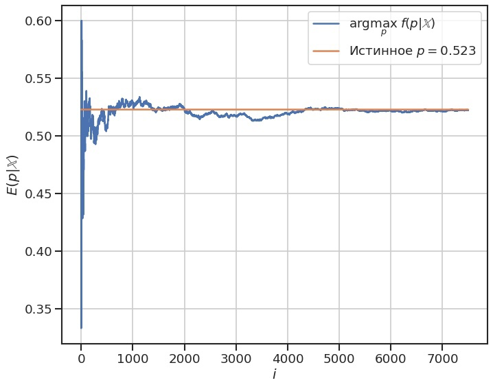
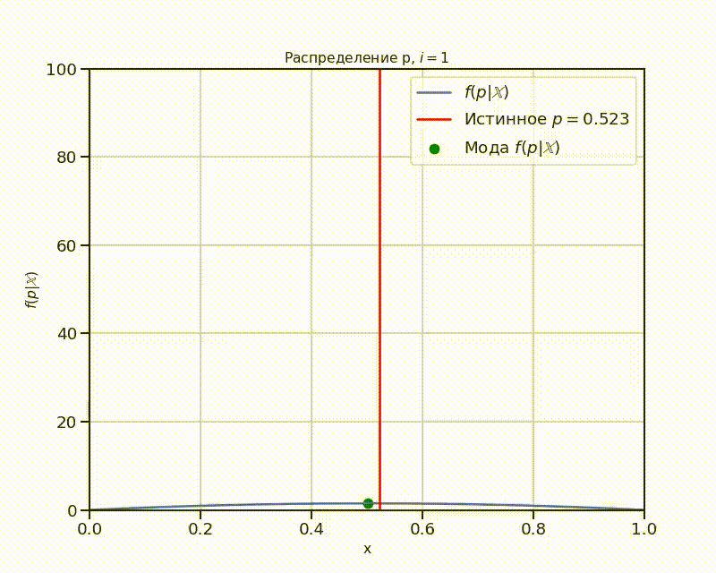

# Немного про Байесовскую статистику
## Задача

Представим, что у нас есть монета, честность которой нам неизвестна (если быть
точным, мы не знаем с каким шансом выпадает орёл, с каким — решка). Поэтому мы
бы хотели оценить вероятность $p$ — шанс выпадения орла [^1].
    
В [классической статистике](https://ru.wikipedia.org/wiki/%D0%A1%D1%82%D0%B0%D1%82%D0%B8%D1%81%D1%82%D0%B8%D0%BA%D0%B0)
эта задача бы решалась бы так:

- Монета подбрасывается $n$ раз.
- Из них $m$ — количество выпавших орлов.
- Отношение $\frac{m}{n}$ будет оценкой $p$.

В [Байесовской
статистике](https://ru.wikipedia.org/wiki/%D0%91%D0%B0%D0%B9%D0%B5%D1%81%D0%BE%D0%B2%D1%81%D0%BA%D0%B0%D1%8F_%D1%81%D1%82%D0%B0%D1%82%D0%B8%D1%81%D1%82%D0%B8%D0%BA%D0%B0)
подход иной:

1. Обозначим монету как [бернуллевскую случайную
   величину](https://ru.wikipedia.org/wiki/%D0%A0%D0%B0%D1%81%D0%BF%D1%80%D0%B5%D0%B4%D0%B5%D0%BB%D0%B5%D0%BD%D0%B8%D0%B5_%D0%91%D0%B5%D1%80%D0%BD%D1%83%D0%BB%D0%BB%D0%B8)
   $\xi$ с параметром $\theta$, у которой $1$ — это выпадение орла, $0$ —
   решки. 
2. Предполагается априорное распределение $\pi(\theta)$ (т.е. распределение,
   которое мы предполагаем, исходя из того, что нам известно о параметре
   $\theta$), как правило, это [равномерное
   распределение](https://ru.wikipedia.org/wiki/%D0%9D%D0%B5%D0%BF%D1%80%D0%B5%D1%80%D1%8B%D0%B2%D0%BD%D0%BE%D0%B5_%D1%80%D0%B0%D0%B2%D0%BD%D0%BE%D0%BC%D0%B5%D1%80%D0%BD%D0%BE%D0%B5_%D1%80%D0%B0%D1%81%D0%BF%D1%80%D0%B5%D0%B4%D0%B5%D0%BB%D0%B5%D0%BD%D0%B8%D0%B5)
   $U \left(0,1\right)$. 
3. Монета подбрасывается. 
4. Распределение $\theta$ уточняется по формуле[^2]:
    $$\Large
    \pi(\theta | \xi) = \frac{p(\xi|\theta)p(\theta)}
    {\int\limits_{\Theta}p(\xi|\theta)p(\theta)d\theta} 
    $$
5. Повторить пункты 2-4, предполагая $\pi(\theta) = \pi(\theta|\xi)$


Тогда оценкой $\theta$ будет:
$$\Large
\hat \theta = \arg \max_\theta \pi ( \theta | \xi )
$$

Иначе говоря,
[мода](https://ru.wikipedia.org/wiki/%D0%9C%D0%BE%D0%B4%D0%B0_%28%D1%81%D1%82%D0%B0%D1%82%D0%B8%D1%81%D1%82%D0%B8%D0%BA%D0%B0%29)
апостериорного распределения.

Мы, в качестве априорного распределения, взяли [Бета-распределения](https://ru.wikipedia.org/wiki/%D0%91%D0%B5%D1%82%D0%B0-%D1%80%D0%B0%D1%81%D0%BF%D1%80%D0%B5%D0%B4%D0%B5%D0%BB%D0%B5%D0%BD%D0%B8%D0%B5) $Beta(2,2)$. В
таком случае, если на $i$-ом шаге мы имеем:
$$\Large
\theta \sim Beta \left( \alpha_i, \beta_i \right) 
$$

то апостериорное распределение будет:

$$\Large
Beta \left( \alpha_i, \beta_i \right) =
\begin{cases}
Beta \left( \alpha_i + 1, \beta_i \right), &\xi_i = 1 \\
Beta \left( \alpha_i, \beta_i + 1 \right), &\xi_i = 0 \\
\end{cases}
$$

Тогда не нужно интегрировать на каждом шаге, что существенно упрощает вычисления.

## Решение 

Приведем решение на `python`.

### Библиотеки

Сначала нужно импортировать  и настроить библиотеки:

```python
import numpy as np
import pandas as pd
import matplotlib.pyplot as plt
import seaborn as sns

from tqdm import tqdm

plt.rcParams.update({'font.size': 14})
```

### Константы и функции

Обозначим константы:

- `p` — истинная вероятность выпадения орла.
- `NMODEL` — количество бросков монеты.
 
```python
p = 0.523
NMODEL = 7501
```

Введем функции:
- `beta` — объект для Бета-распределения
- `coin` — функция одиночного броска монеты

```python
from scipy.stats import beta 
coin = lambda: np.random.binomial(n=1, p=p)
```

### Моделирование

В качестве априорного распределения тут используется Бета-распределение
$Beta(2,2)$. Это сделано потому, что расчет моды накладывает ограничение, что оба
параметра должны быть строго больше 1.

Мода расчитывается по формуле:

$$\Large
\text{Mode} = \frac{\alpha - 1}{\alpha + \beta - 2}
$$

```python
alphas = np.zeros(NMODEL)
betas = np.zeros(NMODEL)
alphas[0], betas[0] = 2,2
for i in tqdm(range(1, NMODEL)):
    A = coin()
    if A == 0:
        betas[i] = 1
    else:
    alphas[i] = 1
 
betas = np.cumsum(betas)
alphas = np.cumsum(alphas)

Es = (alphas - 1) / (alphas + betas - 2)
```

### График

#### Мода

Построим график зависимости моды от количества бросков.

```python
fig, ax = plt.subplots(1, 1, figsize=(10,8), dpi=80)
sns.lineplot(x=np.arange(NMODEL), 
             y=Es, 
             ax=ax, 
             label=r"arg$\max_p \; f(p|\mathbb{X})$", )
sns.lineplot(x=np.arange(NMODEL), 
             y=p, 
             ax=ax, 
             label=r"Истинное $p = {:.3f}$".format(p))
ax.grid()
ax.set(ylabel=r"$E(p|\mathbb{X})$", xlabel=r"$i$");
```



Гифка

Сделаем гифку на тему. Сначала нужно импортировать библиотеку `imageio` и зададим
шаг `STEP` (так как, потом нужно будет сохранять каждый график в опертивной
памяти, что проблематично при большом `NMODEL`):

```python
import imageio
STEP = NMODEL//150
```

После, создадим список функций плотности вероятности:

```python
pi = []
for i in tqdm(range(0, NMODEL)):
    pi.append(beta(alphas[i], betas[i]))
```

И по ним сделаем gif-изображение:

```python
def create_frame(i):
    fig, ax = plt.subplots(1, 1, figsize=(10,8), dpi=80)
    x = np.linspace(0,1,500)
    y = pi[i].pdf(x)
    i_max = np.argmax(y)
    x_max = x[i_max]
    y_max = y[i_max]
    ax.grid()
    ax.plot(x,y, label=r"$f(p|\mathbb{X})$")
    ax.axvline(x = p, color = 'red', label = f"Истинное $p={p}$")
    plt.scatter([x_max], 
                [y_max], 
                color="green", 
                marker="o", 
                label=r"Мода    $f(p|\mathbb{X})$")
    plt.xlim([0,1])
    plt.xlabel('x', fontsize = 14)
    plt.ylim([0,100])
    plt.ylabel(r'$f(p|\mathbb{X})$', fontsize = 14)
    plt.title(r'Распределение p, $i={}$'.format(i+1),
              fontsize=14)
    ax.legend()
    plt.savefig(f'./img/img_{i:04d}.png', 
    transparent = False, 
    facecolor = 'white'
    )
    plt.close()

for i in tqdm(range(0, NMODEL, STEP)):
    create_frame(i)
frames = []
for i in tqdm(range(0, NMODEL, STEP)):
    image = imageio.v2.imread(f'./img/img_{i:04d}.png')
    frames.append(image)
imageio.mimsave('./distributions.gif', 
    frames, 
    fps = 30)
```

Результат:



[^1]: Понятно, что вероятность выпадения решки равна $1 - p$
[^2]: $p(\theta|\xi)$ -- это функция правдоподобия.
